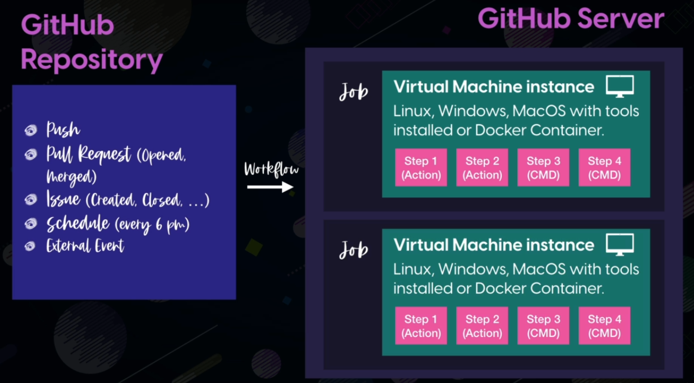

A tool that lets you automate your software developement workflows

You can write individuals tasks , called actions and combine them to create a custom workflow

###Workflow

Custom automated process that you can set up in your repository to build test package realease or deploy any code project in github

##Runner
Machine with Github Actions runner application installed

Runner is responsible for running your jobs
whenever an event happens and display back the results

####Github Hosted Runner

Linux , windows or mac Os virtual environments with commonly used pre installed software

Your cannot customize hardware configuations

####Self Hosted Runner

#### Preinstalled software 